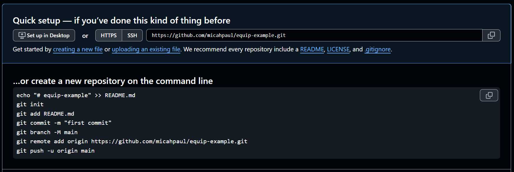

# GitHub Tutorial, 2 April 2025

[GitHub](https://www.github.com) is a platform that allows you to host your code in a code collection, or repository, where other people can see it. It uses the extremely popular [Git](https://git-scm.com/) version control system to help you track the changes you make in your projects.

In this tutorial, we will:
1. make and sign into a github account
1. create a new code repository
1. commit our first file to the repository
1. change the code and commit our changes

## Sign up / sign in
First things first! Let's make a Github account and sign into it.

1. Go to [www.github.com/signup](https://www.github.com/signup).
1. If you've already signed up, GitHub should either forward you to your home page or give you a chance to sign in via a link in the top right corner.

## New repository
This is dead simple. Once you're signed in:
1. Look for the green `New` button on the lefthand side of your homepage.
1. Click the `New` button.
1. Give it a name, add a description if you want, and leave everything else at the default values.
1. Click the `Create repository` button at the bottom of the page.

## Commit your first file
Again, super simple! Once you've created the repository, GitHub should take you to a page that prompts you to create three different files. These aren't mandatory, but GitHub highly recommends adding them to every repository:
1. `README.md` is a description of what the repository does and how it works.
1. `LICENSE.md` tells people what rights you reserve and how they are allowed to use your code.
1. `.gitignore` is a list of files that your repository won't be tracking. (For example, many projects track the source code but not the build or binary output directories where the program is actually generated.)

The really great news is that you have three different choices for setting these up. You can either:
1. Download GitHub Desktop and use it to manage your repositories, or
1. Use Git's command line tool (Git Bash) to type the commands out, or
1. Just click the links that GitHub offers you. 

We're going to choose the third option.

1. Click the `README` link under **Quick Setup**:

1. GitHub automatically generates an empty `README.md` file. You can put whatever text you want in this file, then click Commit Changes.
1. A Commit message dialogue will come up. This is because every commit needs a description so it will be clear what you changed. Just leave the default `Create README.md` message and click `Commit changes`.
1. That's it for this step!

One final thing to note: If you were doing this on your local machine instead of the GitHub server, you'd have an extra step to do after Commit. You'd need to Push your local changes (on your computer) to the remote repository (on GitHub's server). Since we're saving this new file directly to the host server, we don't need to do that for this example.

## Change a file
1. Click on the little pencil icon to the far right of your new `README` filename. 
1. `README.md` will open in an edit screen. Change the text in the file. 
1. Click `Commit changes`.
1. Change the Commit message to whatever you want and click `Commit changes`.
    - Something to note here is that if you wanted, you could make these change in another branch that someone else could review before approving it to be pushed into the `main` branch. This is a really good idea for complicated code changes, but we won't do it in this example.
1. Click the Blame button next to Preview and Code. 
1. For every line in the file, this will show you the last time it was changed, as well as the commit that changed it. 
1. If you click on the commit message for the line you just changed, you'll see a diff page showing you the old text before you changed it as well as your changes: 
    - this is really useful in projects with more than one contributor, to help see who changed something and when and why.

## 2 April Classwork
In class on 2 April 2025, you will receive printed instructions for making a small web page. 

When you are done with it, commit it to your repository and email the repository link to Mr. Hawkinson. You don't have to do it in class if you don't have internet; just finish this part of the assignment before 9 April 2025.