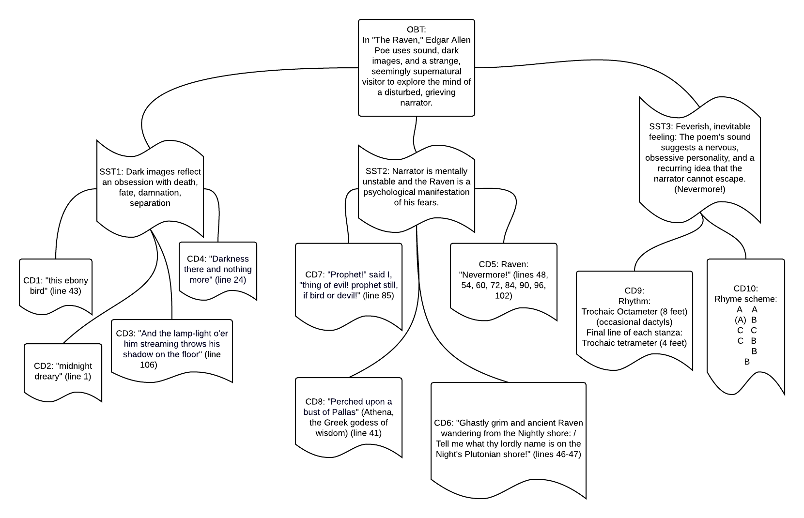

In the [notes for week 2](week-2.md), I ended by promising an example of how one might take many scattered observations and mold them into a more coherent outline. (I called this The Confetti Cannon Problem.) This week, I'll fulfill that promise using the poem we read as an example (Edgard Allen Poe's "The Raven").

### Step 1: Gathering the Confetti

We start out with a bunch of observations about this poem. They seemed important while we were reading, but how can we fit them together? The good news is that we'va already completed the first step: Getting material to work with!

### Step 2: Sorting the Confetti

Now that we have our scattered notes all gathered in one place, let's sort them into piles by topic. I've put "CD" on each of them, for "concrete detail." These will be the pieces of evidence you use to show your reader what you mean when you make a claim or observation about the text. You could think of each concrete detail as one of the very lowest (i.e., most specific) branches of your outline tree.

One group is about how the poem sounds (rhyme and rhythm). Another is about the narrator's obsession with darkness. The third group deals with the narrator's fears and feelings about the raven.

### Step 3: Labeling Each Pile

