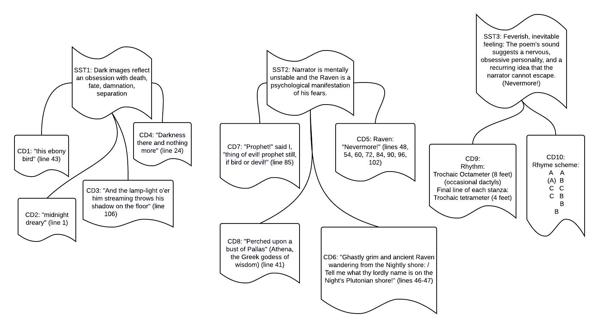

In the [notes for week 2](week-2.md), I ended by promising an example of how one might take many scattered observations and mold them into a more coherent outline. (I called this The Confetti Cannon Problem.) This week, I'll fulfill that promise using the poem we read as an example (Edgard Allen Poe's "The Raven").

### Step 1: Gathering the Confetti

We start out with a bunch of observations about this poem. They seemed important while we were reading, but how can we fit them together? The good news is that we'va already completed the first step: Getting material to work with!

### Step 2: Sorting the Confetti

Now that we have our scattered notes all gathered in one place, let's sort them into piles by topic. I've put "CD" on each of them, for "concrete detail." These will be the pieces of evidence you use to show your reader what you mean when you make a claim or observation about the text. You could think of each concrete detail as one of the very lowest (i.e., most specific) branches of your outline tree.

One group is about how the poem sounds (rhyme and rhythm). Another is about the narrator's obsession with darkness. The third group deals with the narrator's fears and feelings about the raven.

### Step 3: Labeling Each Pile

Let's put names on the different groupings we've made. This will help us think about the poem in a more organized, structured way. If we find that our groupings are inadequate or incorrect, we can always change them later. The important part is to put something down on paper, and then we can improve it later. I've labeled these with "SST" for "Smaller Supporting Things." These are not the one big point of the paper, but they are sub-points that support it.

### Step 4:Bringing it All Together

Now that we've finished sorting and labeling our pile of confetti, let's think about how to fit all of our biggest pieces into one overarching topic. I'll call this "OBT" for "One Big Thing." Our smaller things involve the poem's preoccupation with darkness, the narrator's mental state, and the feeling that the rhythm and rhyme impart to the poem. So I pull them all together and come up with something like this:

It's not finished yet, and you could certainly disagree with some of my interpretations. (I'm not sure that **I** even agree with them at this point.) But it's a start! My notes are  no longer a scattered pile of disconnected facts. I even have a general outline that I can follow when I start actually writing the paper! Little by little, we are shaping the chaos into something orderly and interesting.
