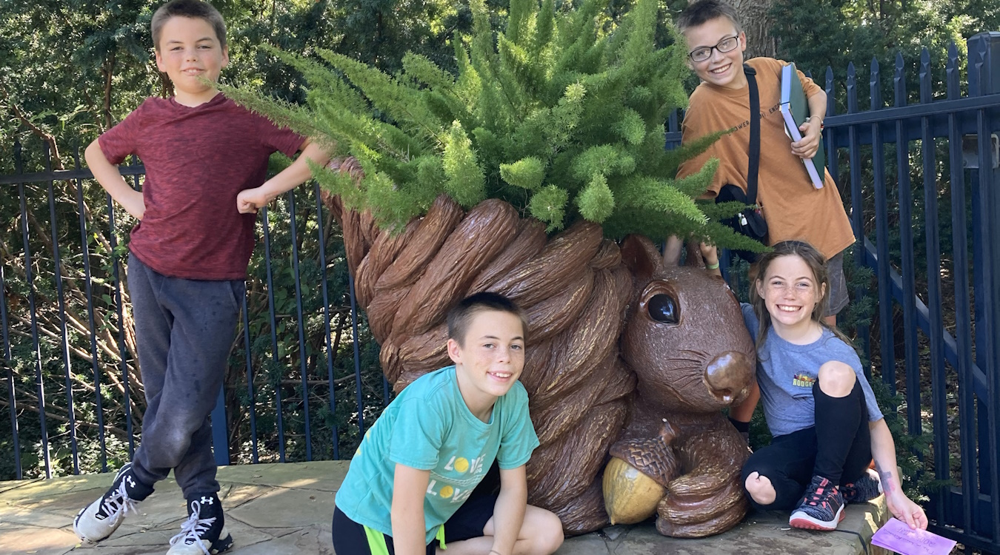
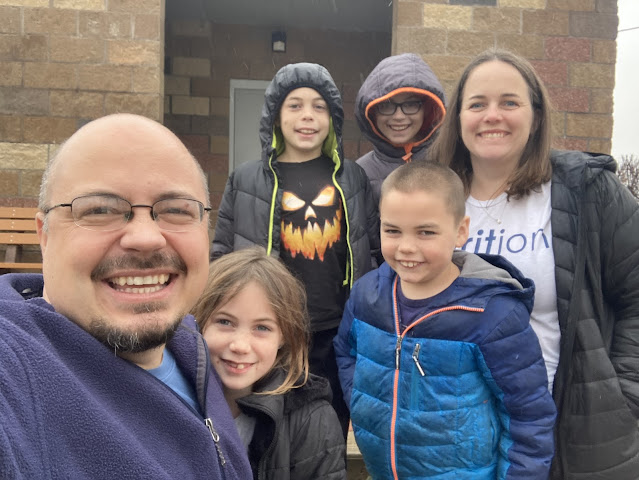

# M. Hawkinson "Christmas" Card 2024:

Dear friends and family:

We didn't send a card in 2023... did you miss us? Things have been busy around here. We got licensed for foster care in Summer 2023, then moved houses and had to re-license! We've gotten to host many short-term placements and just started our second long-term placement a couple of weeks ago.

**I (Micah, 42)** am slowly completing my first novel, in between trips to jail (for work, I promise). **Magen (30ish?)** has been loving football, houseplants, and teaching an election curriculum to the kids this fall. **Myrick (14)** is excited to attend Hutchmoot with me this year. **Matt (12)** is a bookworm who excels us all in many things, including running and piano. **Zed (10)** continues to be our best swimmer and has all the NFL teams memorized by division. **Madelynne (9)** is into gymnastics, cross country, and helping me with all the household projects. Our foster daughter **"Lily" (born September 2024)** is chiefly interested in drinking milk, making dirty diapers, and sleeping.

In everything from lunar eclipses to newborn snuggles, we see God's goodness drenching the world around us. We are grateful for all the good things He gives, and especially for His son Jesus, who heals our brokenness and allows us to share His abundant life.

Visit [linktr.ee/mhawks](https://linktr.ee/mhawks) for a longer update from your affectionate

M. Hawkinsons
 731 SW Morningside Rd
 Topeka, KS 66606

---

# M. Hawkinson "Christmas" Card 2024: Extended Edition!

We wanted to say more, but the postcard just didn't have enough space. And so much has happened since the last time we sent a card out! Where to begin? 

How about in 2022, right after we sent out our last "Christmas in July" card...

## 2022
### August
* Zed and Madelynne got baptized!

### October
* We went to the Rogue Invitational in Austin, which was fun!
* Magen's van got hit by a deer on the way home, which was not.
* Matt and Dad went on a man trip to San Antonio.

### November
* We hosted our first Maker Meetup gathering for local creative friends in Topeka.

### December
* Micah and Magen got to visit Fusion's home office in New Jersey for the Christmas party! We also took a quick trip into New York City to see the Christmas lights.

## 2023
### April
* We finished licensing to do foster care
* Micah spent a week and a half in Nashville working on his historical novel (with monsters) set in the world of Beowulf and St. Brendan the Navigator.
  * Sometimes Micah's full of hope about this project. Sometimes he wants to forget about the whole silly thing. Pray for him when you think of it.

### June
* We took our first short-term foster placement.

### July
* We sold our house on Mission Ave. It was sad to leave a place where we had so many great neighbors and memories, but we were also glad to move to a place with a **lot** more room.

### August
* Magen went to the Crossfit Games in Madison while the rest of us went to our church's family camp in the Oklahoma Ozarks.

### November
* We took our first long-term foster placement, a delightfully smiley 8-month-old boy.

### December
* Matt and Zed went to Arizona with Micah to celebrate Immanuel Mission's 100th anniversary and Navajo Christmas.

## 2024
### January
* We took **many** short-term Police Protective Custody placements of infants in January-March 2024. Our 10-month-old foster son really liked looking at the babies and "being gentle!" 

### March
* Micah and Magen celebrated her birthday with a getaway to Tulsa.

### April
* Micah and Magen got to see Drew Holcomb at Knuckleheads in Kansas City. Fortunately, they were able to avoid tornadoes on the way there, and there was only a short weather delay for the outdoor concert.

### May
* Myrick went to Leadership Training Camp at Kansas Bible Camp. He really enjoyed staffing there this summer.

### June
* Micah spent a week at a juvenile correctional facility in Ohio. Once more, the people were great!

### July
* Our foster son got to go back to live with his mom. This was an occasion for great excitement, but we also miss him terribly. 
  * Micah wrote an essay about this experience. It will be published in [Matthew Clark](https://www.matthewclark.net/)'s forthcoming collection, *Where the River Goes*, sometime in 2025.

### August
* Zed and Dad went on a Man trip to Tulsa.
* Grandma Wullschleger passed away. We were sad, but also hope to see her again one day. We were delighted to be able to see so much family at the funeral.

## Other Noteworthy Tidbits:
* Micah has loved being part of the [Habit Community](https://thehabit.co/) and attending in-person writers' retreats with his friends from that group twice per year. 
* Myrick looks forward to attending Hutchmoot with Micah this October (Myrick's first time, Micah's 12th).
* Micah has enjoyed traveling to several correctional facilities for work, meeting wonderful nursing staff and spending time with remote co-workers in person. So far, he's been to Louisiana, Rhode Island, and Ohio, and he hopes to add more to the list soon.
* We continue working on our [Toddling Through Kansas](https://kstoddles.blogspot.com/) project whenever we can. 300 towns done, about 600 to go!
* Zed has been loving sports: swimming, basketball, and soccer.
* Myrick ran cross country 2022-2023, then switched to theater in 2024.
* Matt ran cross country 2023-2024.
* Madelynne played Upward basketball in 2024, and she loves her weekly gymnastics class. 

We love you people. Jesus does, too. May grace and peace surround you as you walk through the year ahead.

With much love,

-Micah, Magen, Myrick, Matt, Zed, and Madelynne Hawkinson