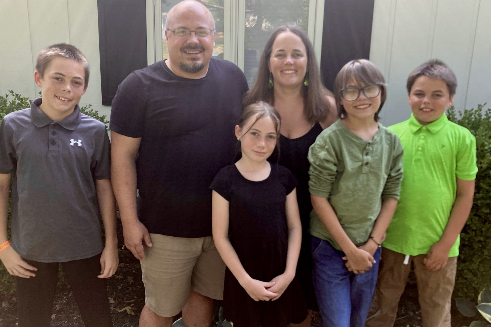

# M. Hawkinson "Christmas" Card 2025:

Dear friends and family:

The title "Christmas in July" once again proves more aspirational than accurate for the present correspondence. For this, we tender our humblest and sincerest apologies. On the plus side, you're probably still reading this before actual Christmas, so we'll call that a win.

Here's what we've been up to over the past year:

**Magen (25ish?)**
* Turned 40 this year and has officially been a Hawkinson longer than a Rodgers
* Is working to modernize and incorporate our homeschool academy
* Had 6 foster babies in our home this last year (no placement at the moment, though)
* Put so so many miles on the van
* Keeps chugging away at her cross-stitch quilt but now has competition in the form of Madelynne
* Has gotten to the pool as much as she can this summer, though it's hard with all the kids' activities!

**Myrick (15)** 
* Worked at three different Bible camps this summer (Kansas Bible Camp, Camp Enosh, Turkey Hill Ranch)
* Helps the Topeka Bible Church youth group with music and games
* Attended his first Hutchmoot with Dad in 2024 and is excited to go back in 2025
* Took a 15-year-old trip to Chicago with Mom
* Is Learning to drive 
* Loves being involved in choir, theatre, and piano

**Matt (13)** 
* Is officially a brooding teenager
* Dominated Water Safety class where he had to swim ten minutes fully dressed with shoes on, then tread water while using his shirt and pants as floation devices
* Got teeth removed in anticipation of upcoming braces
* Participated in cross country, choir, theatre, and piano
* Is reading so much
* Volunteers to help teach Sunday School

**Zed (11)** 
* Took a 10-year-old trip to Tulsa
* Traveled to Cincinnati with Mom for a Bengals game
* Has become quite the jock - soccer, strength workouts, basketball clinics, football!  
* Plays a mean ukulele
* Got his room got painted and redecorated with a new rug and bulletin board
* Went to so many summer camps

**Madelynne (10)** 
* Is becoming a bit of a cross country prodigy
* Had a pajama party for her 10th birthday
* Is planning a 10-year-old trip to Omaha with Mom 
* Went to Kansas Bible Camp for the first time this summer
* Loved doing gymnastics (including a competition) this year 
* Enjoys lots of arts and crafts -- we regularly need to reinvent her room to contain it all! 
* Can run the household singlehandedly

**Micah (43)**
* Spent a week in March at The Habit Membership's writing retreat in Nashville and finished the first draft of his novel!
* Has studiously procrastinated in the revision process ever since
* Had an essay published this spring and looks forward to a few small poems being published this fall
* Spent some time in jail this year - specifically, visiting customers in Arizona and Tennessee
* Is loving his men's Bible study in Galatians, as well as his Sunday School class, which is almost halfway through Matthew
* Hit the 1,000-lb club with combined back squat (400), deadlift (355), and bench press (305) this year
* Sometimes wishes we didn't drive such old cars ):

If you want to stay in touch, you can keep up with our [travels through Kansas here](https://kstoddles.blogspot.com/), email us at micahpaul@gmail.com, or (best of all?) write to us at the address below.

That's all for now. We love you, and so does Jesus!

Your friends,

The M. Hawkinsons
 731 SW Morningside Rd
 Topeka, KS  66606
